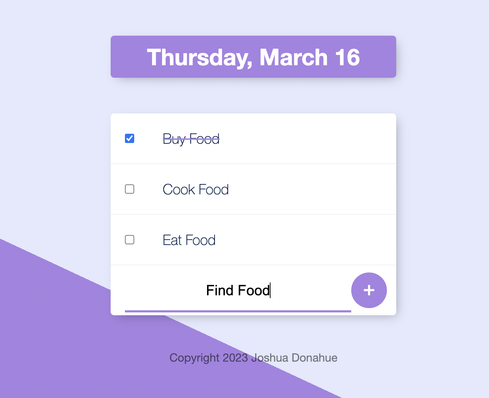
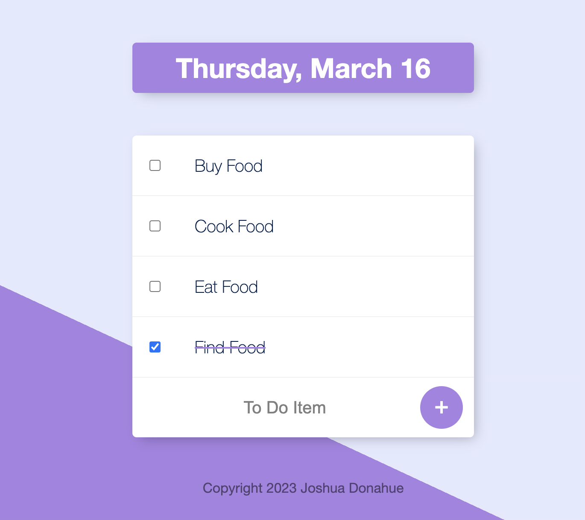
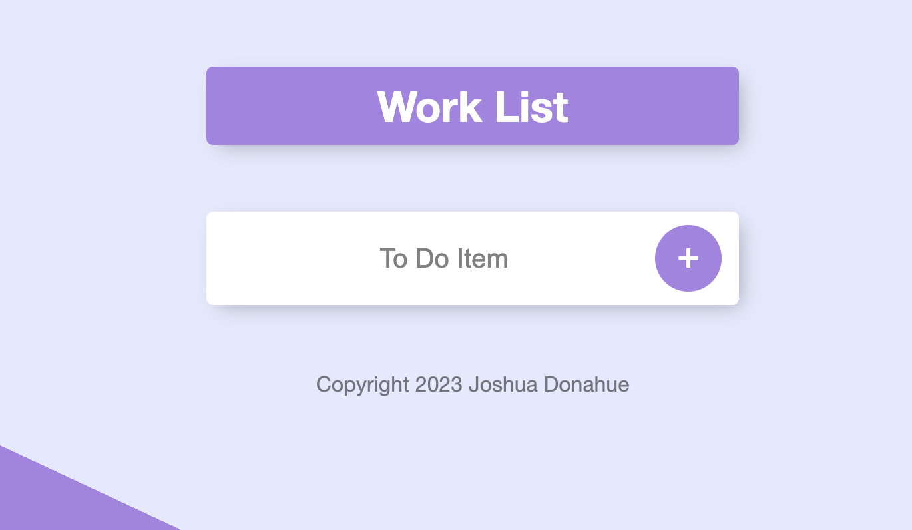
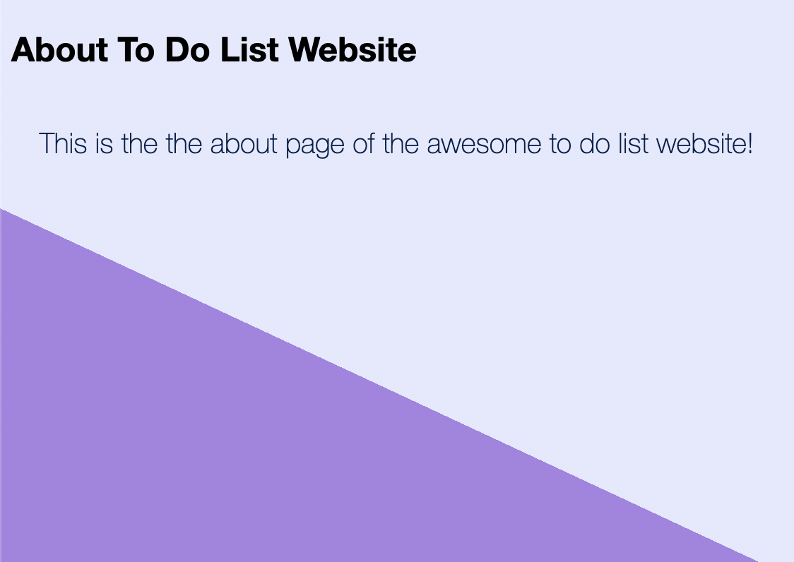

# To-Do List v1

This project is a To-Do List app using Node.js, Express.js, and EJS. The primary focus is EJS templates/layout customization. There is a normal To-Do List & also a work To-Do List.

---

## Normal To-Do List

There is a normal To-Do List found on the "/" home path where you can add items to the list. Example: https://stormy-earth-28542.herokuapp.com/ 

---

## >Work To-Do List

There is a normal To-Do List found on the "/work" path where you can add items to the list. Example: https://stormy-earth-28542.herokuapp.com/work

---

## About Page

There is also an about page for the app which can be found at "/about" path. https://stormy-earth-28542.herokuapp.com/about

